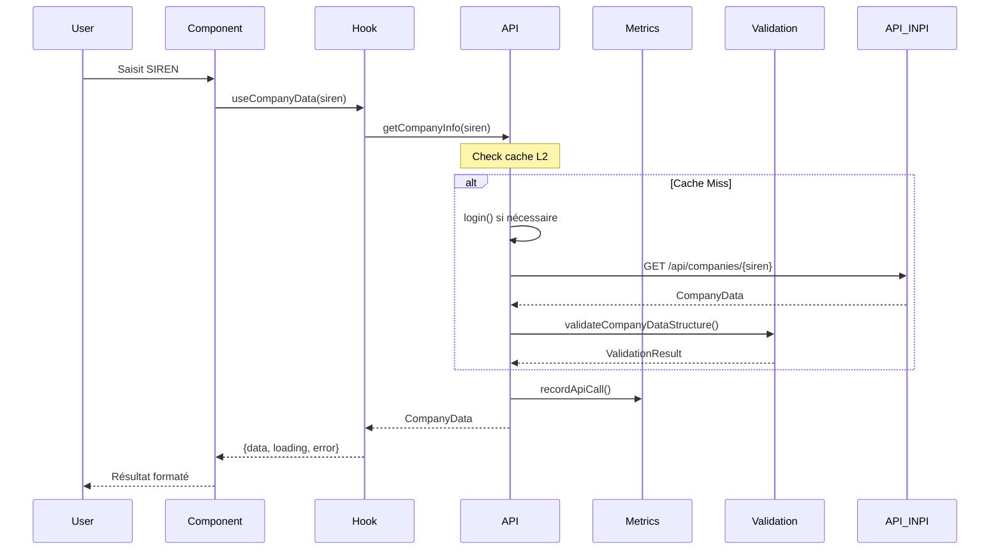
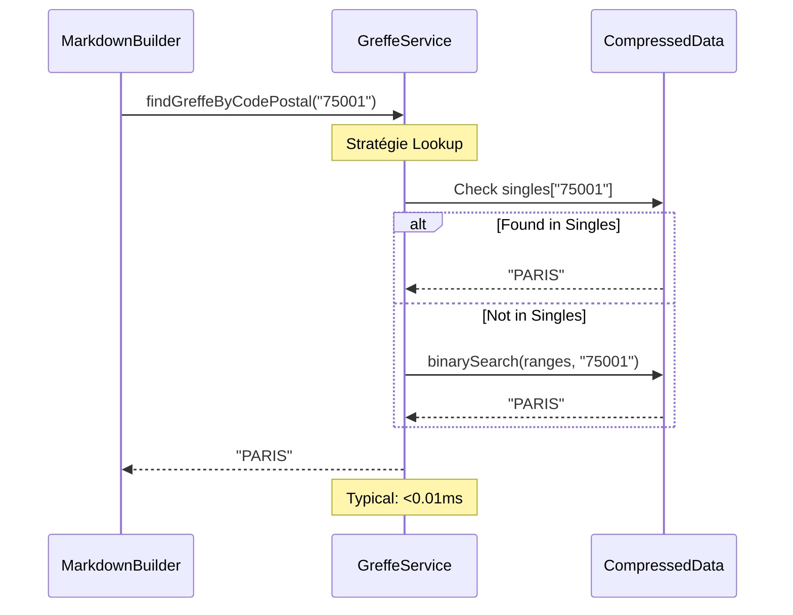

# Architecture Technique

## 🏗️ Vue d'Ensemble

L'extension French Company Search suit une architecture modulaire optimisée pour les performances, la fiabilité et la maintenabilité.

```
┌─────────────────┐    ┌─────────────────┐    ┌─────────────────┐
│   UI Components │    │    Services     │    │   Data Layer    │
│                 │    │                 │    │                 │
│ • SearchForm    │────│ • INPI API      │────│ • Cache         │
│ • CompanyDetail │    │ • Greffe Lookup │    │ • Greffe Data   │
│ • ErrorView     │    │ • Metrics       │    │ • Validation    │
│ • Metadata      │    │ • Validation    │    │ • Types         │
└─────────────────┘    └─────────────────┘    └─────────────────┘
         │                       │                       │
         └───────────────────────┼───────────────────────┘
                                 │
                    ┌─────────────────┐
                    │  Monitoring &   │
                    │   Observability │
                    │                 │
                    │ • Performance   │
                    │ • Health Checks │
                    │ • Error Tracking│
                    └─────────────────┘
```

## 📦 Structure du Projet

```
src/
├── components/           # Composants UI React
│   ├── CompanyDetailsView.tsx
│   ├── CompanyMetadata.tsx
│   └── ErrorView.tsx
├── hooks/               # Custom React Hooks
│   └── useCompanyData.ts
├── services/           # Services métier
│   ├── inpi-api.ts     # Client API INPI
│   ├── greffe-lookup.ts # Recherche greffe optimisée
│   ├── markdown-builder.ts # Génération texte légal
│   ├── metrics.ts      # Collecte métriques
│   └── api-validation.ts # Validation API
├── utils/              # Utilitaires
│   └── formatting.ts   # Formatage données françaises
├── types/              # Définitions TypeScript
│   └── index.ts
└── __tests__/          # Tests
    ├── integration/    # Tests d'intégration
    ├── performance/    # Tests de performance
    └── services/       # Tests unitaires

assets/
├── greffes-index.json          # Données greffe originales
├── greffes-index-compressed.json # Données optimisées
└── role-mappings.json          # Mappings rôles juridiques

scripts/
└── compress-greffes.ts         # Compression données

transform/
└── build-greffes-index.ts      # Construction index greffe

docs/
├── ARCHITECTURE.md
└── TROUBLESHOOTING.md
```

## 🔧 Composants Clés

### 1. Couche UI (React Components)

#### `SearchForm`
- **Responsabilité:** Interface de recherche avec validation SIREN/SIRET
- **Validation:** Format 9/14 chiffres en temps réel
- **État:** Gestion loading et erreurs

#### `CompanyDetail`
- **Responsabilité:** Orchestration affichage résultats
- **Hooks:** `useCompanyData` pour gestion état
- **Actions:** Copy vers presse-papier (HTML/Plain text)

#### `CompanyDetailsView` / `CompanyMetadata`
- **Responsabilité:** Rendu données formatées
- **Séparation:** Contenu vs métadonnées
- **Formatage:** Utilisation des utilitaires de formatage

### 2. Couche Services

#### `inpi-api.ts` - Client API INPI
```typescript
interface ApiClient {
  login(): Promise<string>              // Authentification avec cache
  getCompanyInfo(siren: string): Promise<CompanyData>  // Données société
  clearCache(): void                    // Nettoyage cache
}

Features:
• Cache authentification (10 min TTL)
• Cache données société (5 min TTL)  
• Rate limiting automatique (30 req/min)
• Retry avec backoff exponentiel
• Métriques automatiques
```

#### `greffe-lookup.ts` - Recherche Greffe Optimisée
```typescript
interface GreffeService {
  findGreffeByCodePostal(code: string): string | null  // Recherche O(1) ou O(log n)
  getCompressionStats(): CompressionStats             // Statistiques compression
}

Performance:
• Lookup moyen: <0.01ms
• Données compressées: 251KB (84% réduction)
• Fallback automatique format original
• Cache binaire pour ranges
```

#### `metrics.ts` - Collecte Métriques
```typescript
interface MetricsSystem {
  recordApiCall(metric: ApiMetrics): void              // Enregistrement automatique
  getStats(timeRange?: number): PerformanceStats      // Statistiques période
  getHealthStatus(): HealthStatus                     // État santé système
}

Métriques collectées:
• Temps de réponse (avg, P95, P99)
• Taux de succès par endpoint
• Erreurs par type
• Utilisation cache
```

#### `api-validation.ts` - Validation Structure API
```typescript
interface ValidationSystem {
  validateCompanyDataStructure(data: any): ValidationResult    // Validation structure
  detectApiChanges(current: any, baseline: any): ChangeDetection  // Détection changements
  createApiBaseline(response: CompanyData): Baseline           // Création baseline
}

Validation:
• Structure PersonneMorale/PersonnePhysique
• Compatibilité formats API ancien/nouveau
• Détection changements avec niveau de risque
```

### 3. Couche Data

#### Système de Cache Multi-Niveau
```typescript
// Cache L1: Authentification (en mémoire)
authToken: { token: string; expiresAt: number }

// Cache L2: Données société (en mémoire, 5 min)
companyCache: Map<string, { data: CompanyData; timestamp: number }>

// Cache L3: Données greffe (sur disque, compressées)
greffeData: CompactGreffeData
```

#### Optimisation Données Greffe
```typescript
// Format original: 28,136 entrées = 1.57MB
Record<string, string>  // "75001" → "PARIS"

// Format compressé: 6,337 entrées = 251KB  
interface CompactGreffeData {
  ranges: GreffeRange[]     // Plages consécutives
  singles: Record<string, string>  // Codes isolés
  metadata: CompressionMetadata
}

// Algorithme de recherche hybride:
// 1. Lookup direct dans singles O(1)
// 2. Recherche binaire dans ranges O(log n)
// 3. Performance: <10ms garanti, <0.01ms typique
```

## ⚡ Optimisations Performance

### 1. Données Greffe - Compression 84%

**Problème Original:**
- 28,136 mappings code postal → greffe
- Fichier 1.57MB chargé à chaque démarrage
- Lookup O(1) mais empreinte mémoire élevée

**Solution Implémentée:**
```typescript
// Détection des plages consécutives
// 75001, 75002, 75003 → "PARIS" devient:
{ start: "75001", end: "75003", greffe: "PARIS" }

// Codes isolés restent en mapping direct
{ "20000": "AJACCIO" }  // Code Corse isolé

// Résultat: 77% réduction entrées, 84% réduction taille
```

### 2. Cache Stratégique Multi-Couche

**L1 - Token Cache (10 min):**
- Évite re-authentification excessive
- Gestion expiration automatique
- Invalidation sur erreur 401

**L2 - Company Cache (5 min):**
- Évite appels API répétés même SIREN
- TTL adapté à fréquence changements données
- Invalidation manuelle possible

**L3 - Greffe Cache (permanent):**
- Données statiques, changent rarement
- Compressed format pour économie mémoire
- Fallback sur format original

### 3. Rate Limiting Intelligent

```typescript
class RateLimiter {
  private calls: number[] = []
  private readonly maxPerMinute = 30
  
  checkLimit(): void {
    const now = Date.now()
    // Sliding window: supprime calls > 1 min
    this.calls = this.calls.filter(time => time > now - 60000)
    
    if (this.calls.length >= this.maxPerMinute) {
      throw new Error("Rate limit exceeded")
    }
    
    this.calls.push(now)
  }
}
```

## 🎯 Patterns Architecturaux

### 1. Error Handling Pattern

```typescript
// Propagation structurée des erreurs
try {
  const data = await getCompanyInfo(siren)
  return formatCompanyData(data)
} catch (error) {
  if (error.status === 404) {
    return { error: "Company not found", fallback: "Check SIREN format" }
  }
  // Log + metrics automatiques
  metrics.recordError(error)
  throw new UserFriendlyError("Service temporarily unavailable")
}
```

### 2. Retry with Backoff Pattern

```typescript
async function withRetry<T>(fn: () => Promise<T>, maxRetries = 3): Promise<T> {
  for (let i = 0; i < maxRetries; i++) {
    try {
      return await fn()
    } catch (error) {
      if (i === maxRetries - 1) throw error
      
      const delay = Math.min(1000 * Math.pow(2, i), 5000)  // Cap à 5s
      await new Promise(resolve => setTimeout(resolve, delay))
    }
  }
}
```

### 3. Observer Pattern pour Métriques

```typescript
// Collecte automatique sans couplage
class ApiCall {
  async execute() {
    const startTime = Date.now()
    try {
      const result = await this.performCall()
      this.notifySuccess(Date.now() - startTime)
      return result
    } catch (error) {
      this.notifyError(error, Date.now() - startTime)
      throw error
    }
  }
  
  private notifySuccess(duration: number) {
    metrics.recordApiCall({
      endpoint: this.endpoint,
      responseTime: duration,
      success: true
    })
  }
}
```

## 🔄 Flux de Données

### 1. Recherche Société (Flux Principal)



### 2. Lookup Greffe (Optimisé)



## 📊 Monitoring et Observabilité

### 1. Métriques Automatiques

```typescript
// Collectées automatiquement sur chaque appel API
interface ApiMetrics {
  endpoint: string         // "/api/companies/123456789"
  method: string          // "GET"
  responseTime: number    // Temps en ms
  statusCode: number      // 200, 404, 500, etc.
  success: boolean        // true/false
  errorType?: string      // "AxiosError", "NetworkError"
  retryCount?: number     // Nombre de tentatives
  timestamp: number       // Date d'enregistrement
}
```

### 2. Health Checks

```typescript
// Vérification santé automatique
const healthCriteria = {
  minSuccessRate: 95,        // 95% minimum
  maxAvgResponseTime: 3000,  // 3s maximum
  maxP95ResponseTime: 5000   // 5s P95 maximum
}

// Évaluation continue
PerformanceMonitor.isHealthy() // boolean
PerformanceMonitor.getHealthStatus() // détails + recommandations
```

### 3. Alerting et Diagnostics

```typescript
// Logs automatiques en développement
if (responseTime > 5000) {
  console.warn(`[PERF] Slow API call: ${endpoint} took ${responseTime}ms`)
}

if (successRate < 80) {
  console.warn(`[PERF] High error rate: ${successRate}% over 5 minutes`)
}
```

## 🛡️ Sécurité et Résilience

### 1. Gestion Credentials

```typescript
// Stockage sécurisé via Raycast
const preferences = getPreferenceValues<Preferences>()

// Validation côté client
function validateCredentials(username: string, password: string) {
  if (!username?.includes('@')) {
    throw new Error("Username should be an email")
  }
  // Pas de validation password complexe pour éviter faux positifs
}
```

### 2. Protection Rate Limiting

```typescript
// Prévention abus API
const rateLimiter = new RateLimiter(30, 60000) // 30 req/min

// Gestion erreurs 429
if (error.status === 429) {
  const retryAfter = error.headers['retry-after'] || 60
  await sleep(retryAfter * 1000)
  return retry()
}
```

### 3. Validation Données

```typescript
// Validation stricte structure API
const validation = validateCompanyDataStructure(response)
if (!validation.valid) {
  // Log erreurs pour debugging
  console.error('API structure changed:', validation.errors)
  
  // Fallback gracieux avec données partielles
  return buildMarkdownWithFallbacks(response)
}
```

## 🔮 Évolution et Extensibilité

### 1. Plugin Architecture

L'architecture permet l'ajout facile de nouveaux services:

```typescript
// Interface commune pour services de données légales
interface LegalDataService {
  validateInput(input: string): boolean
  fetchData(identifier: string): Promise<CompanyData>
  formatOutput(data: CompanyData): string
}

// Implémentations spécifiques
class InpiService implements LegalDataService { /* ... */ }
class GrenobleService implements LegalDataService { /* ... */ }
```

### 2. Monitoring Extensions

```typescript
// Métriques custom facilement ajoutables
metrics.recordCustomMetric({
  name: 'greffe_lookup_performance',
  value: lookupTime,
  tags: { postal_code: code, greffe: result }
})
```

### 3. API Adaptability

```typescript
// Système de validation détecte automatiquement changements
const changes = detectApiChanges(newResponse, baseline)
if (changes.riskLevel === 'high') {
  // Notification développeur + fallback automatique
  notifyApiChange(changes)
  return handleDeprecatedFormat(newResponse)
}
```

Cette architecture garantit performance, fiabilité et maintenabilité à long terme tout en conservant la simplicité d'usage pour l'utilisateur final.